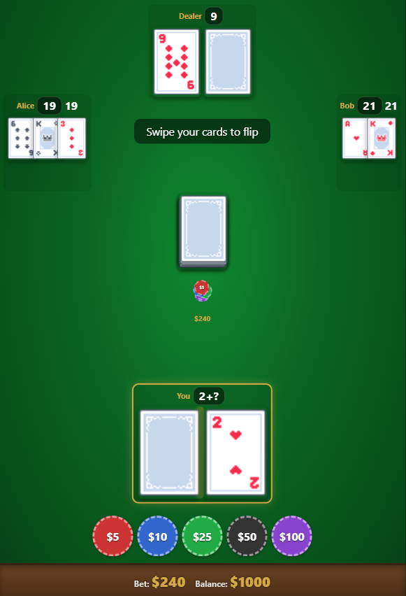

# BlackJack ♠ with House Rules / ハウスルール付きブラックジャック

## Play プレイ ---> [here こちら](https://phuahjinwei.github.io/BlackJack-Mobile/)

## 🏠 House Rules (Important!)

### 1) Escape (only on initial 15)
If the **sum of your first 2 cards is exactly 15**, you may choose to **Escape** the round.

**Escape result:** You **surrender** the round and lose **½ your bet** (0.5x), then the round ends.

> Example: Bet = 100 → Escape → you lose 50.

---

### 2) Stand restriction after you hit
If you have **more than 2 cards** in your hand **and** your total score is **≤ 15**, you **cannot Stand**.

✅ You must keep **Hitting** until your total is **16+** or you bust.

---

### 3) “21” doubles the stakes
If a round ends with a final score of **21** (player or dealer), the round becomes **double-stakes**:

- Winner gains **x2**
- Loser loses **x2**

> Example: Bet = 100 → someone ends with 21 → winner +200 / loser -200

---

### 4) Five-card rule (Player only)
If you reach **5 cards** in your hand, the round resolves immediately:

- **5 cards and NOT bust** → **instant win at x2**
- **5 cards and score = 21** → **instant win at x3**
- **5 cards and bust** → **lose at x2**

> This rule can override normal dealer resolution because it ends the round instantly when you hit your 5th card.

---

# （日本語）BlackJack ♠（ハウスルール付き）
## 🏠 ハウスルール（重要）

### 1）エスケープ（最初の2枚が15のときのみ）
最初に配られた **2枚の合計がちょうど15** の場合、このラウンドを **エスケープ** することができます。

**エスケープの結果：** ラウンドを降りて **ベット額の半分（0.5倍）を失い**、その時点でラウンド終了となります。

> 例：ベット=100 → エスケープ → 50失う

---

### 2）ヒット後のスタンド制限
手札が **3枚以上** で、かつ合計スコアが **15以下（≤15）** の場合、**スタンドできません**。

✅ 合計が **16以上** になるまで（またはバーストするまで）**ヒットし続ける必要があります**。

---

### 3）「21」は倍率が2倍（ダブルステークス）
ラウンドの最終結果が **21（プレイヤー or ディーラー）** で終わった場合、そのラウンドは **ダブルステークス** になります。

- 勝者：**x2の勝ち**
- 敗者：**x2の負け**

> 例：ベット=100 → どちらかが21で終了 → 勝者 +200 / 敗者 -200

---

### 4）5枚ルール（プレイヤーのみ）
プレイヤーの手札が **5枚** になった時点で、即座に勝敗が確定します。

- **5枚でバーストしていない** → **即勝利（x2）**
- **5枚でスコアが21** → **即勝利（x3）**
- **5枚でバースト** → **即敗北（x2）**

> 5枚目を引いた時点でラウンドが強制終了するため、通常のディーラー処理より優先される場合があります。
